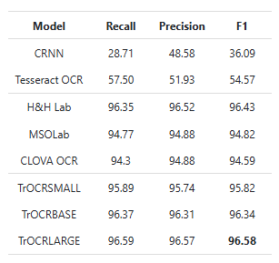
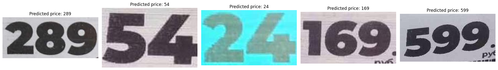

# Распознавание цен на изображениях при помощи модели TrOCR

## Данные

Данные можно загрузить по ссылке на [Google Drive](https://drive.google.com/drive/folders/14308PymySY8nPf3iue_lYQXBAASPy2sE?usp=sharing).

## Информация о выбранном алгоритме

В файле `price_recognition.py` располагается класс для распознавания цен по изображениям. В качестве алгоритма была выбрана предобученная модель [TrOCR](https://huggingface.co/docs/transformers/model_doc/trocr), потому что она основана на трансформерах и показывает высокую точность при распознавании текста на изображениях. Модели Tesseract и EasyOCR основны на рекуррентных и сверточных нейронных сетях и не показывают столь же высокого качества. Архитектура выглядит следующим образом:


В [бенчмарках](https://paperswithcode.com/paper/trocr-transformer-based-optical-character/review/) можно увидеть, что модели семейства TrOCR демонстрируют гораздо более высокое качество, чем CRNN и TesseractOCR.



В качестве модели было решено выбрать [`microsoft/trocr-base-printed`](https://huggingface.co/microsoft/trocr-base-printed) для работы с печатными символами.

Для загрузки предобученной модели можно:
1) Скачать архив с установленными весами модели по ссылке на [Google Drive](https://drive.google.com/file/d/1-SmLrnUqdh19EAoEs2kYc2aahCmYtM9I/view?usp=drive_link) и распаковать в текущую директорию.
2) Загрузить модель самостоятельно, заменив в файле строки кода
```python
self.model_dir = "./saved_model"
self.processor = TrOCRProcessor.from_pretrained(self.model_dir)
self.model = VisionEncoderDecoderModel.from_pretrained(self.model_dir)
```
на
```python
processor = TrOCRProcessor.from_pretrained('microsoft/trocr-base-printed', use_fast=True)
model = VisionEncoderDecoderModel.from_pretrained('microsoft/trocr-base-printed')
```
или вместо `microsoft/trocr-base-printed` можно использовать другую модель этого же семейства.

## Результаты модели

В ходе проверки модели на валидационной выборке была получена точность в **97.7%**. Результаты работы модели на тестовых данных можно посмотреть в csv-файле `test_predictions.csv`. На рисунке ниже изображены прогнозы модели на небольшой подвыборке тестовых данных:


